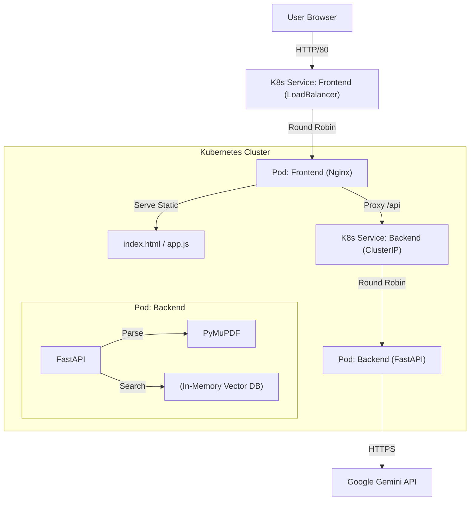

# AI Legal Document Assistant

A RAG-based legal document assistant that allows users to upload PDFs and ask questions using Google's Gemini Flash model.

[](https://legal-ai-doc-assistant.vercel.app)

**Access the live application here:** [https://legal-ai-doc-assistant.vercel.app](https://legal-ai-doc-assistant.vercel.app)

## Features
- **User Authentication**: Secure Sign In/Registration with JWT and Session/Local Storage options.
- **RAG Architecture**: Retrieves relevant context from the document to answer queries accurately.
- **Gemini Flash Integration**: High-speed, low-latency responses.
- **Premium UI**: Animated background, glassmorphism design, and real-time feedback.
- **Persistent Data**: User-scoped document storage and chat history (Postgres/SQLite).
- **Security Features**: Password hashing (bcrypt), security questions for reset, and data isolation.
- **Self-Evaluation**: Automatically grades answers on Helpfulness, Completeness, and Relevance.
- **Privacy-First**: Documents are processed locally within the container.

## Authentication & Login
Each user has their own private workspace. The app includes:
- **Sign In / Sign Up**: Secure access to your documents.
- **Remember Me**: Option to stay logged in or use a temporary session.
- **Password Recovery**: Reset your password using personalized security questions.

## Architecture
The application is containerized using Docker and designed to run on Kubernetes with high availability.

### High-Level Design


### Components
1.  **Frontend (Nginx)**: 
    -   Serves the static web assets.
    -   Acts as a reverse proxy, forwarding `/api` requests to the internal backend service.
    -   Running 2 Replicas for availability.
    
2.  **Backend (FastAPI)**:
    -   Handles file processing, embedding, and LLM interaction.
    -   Stateless design allows for horizontal scaling.
    -   Running 2 Replicas.

3.  **Kubernetes Resources**:
    -   **Deployments**: Manage the pod replicas.
    -   **Services**: Expose the frontend externally and the backend internally.
    -   **Secrets**: Securely store the `GEMINI_API_KEY`.

## Project Structure
- [`backend/`](backend/README.md): FastAPI application (Python).
- [`frontend/`](frontend/README.md): Vanilla JS/HTML/CSS interface.
- [`k8s/`](k8s/README.md): Kubernetes manifests for deployment.

## Quick Start (Docker)

1.  **Clone the repository**:
    ```bash
    git clone https://github.com/hamzax180/legal-document-assistant.git
    cd legal-document-assistant
    ```

2.  **Set up Environment**:
    Create a `.env` file in the root or `backend/` directory with your API key:
    ```env
    GEMINI_API_KEY=YOUR_ACTUAL_API_KEY
    ```

3.  **Build and Run**:
    ```bash
    docker-compose up --build
    ```
    *(Note: If you don't have docker-compose, check `k8s/README.md` for individual build commands)*

4.  **Access**:
    Open `http://localhost` in your browser.

## Kubernetes Deployment
See [k8s/README.md](k8s/README.md) for detailed instructions on deploying to a local Kubernetes cluster.

## Security Note
This project requires a Google Gemini API Key.
**NEVER commit your API key to version control.**
ALWAYS use environment variables or Kubernetes Secrets.

## License
MIT
